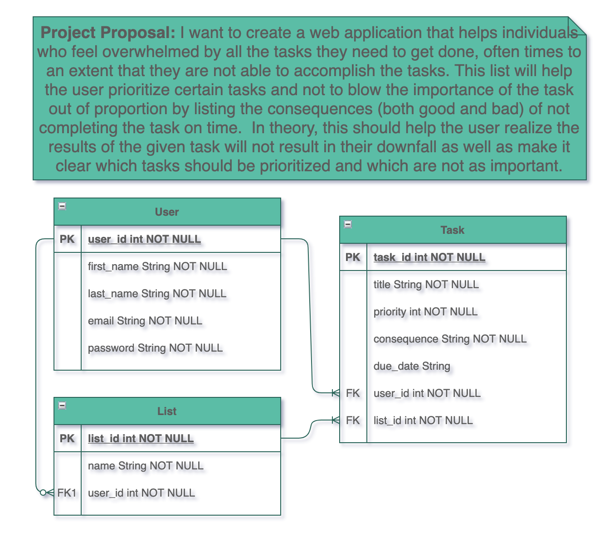
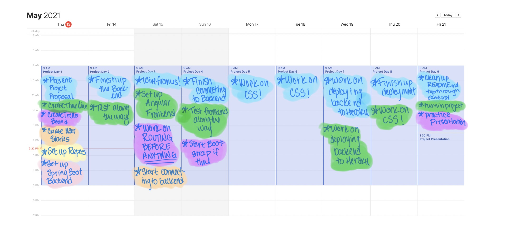

# Capstone-Backend
## Overview & Technology Used
This is the backend for my capstone project in the Java Immersive taught by General Assembly and hosted by Interapt 
and CVS. 

In the project, we were tasked with creating a web application that displayed the culmination of all the skills
we had learned during the immersive. This backend is an API that was built in SQL using the framework Spring Boot. It has been 
deployed to Heroku and uses JWTs for security.  The database keeps track of user and todo lists they may have as well
as the tasks within the lists.
## Planning
The very step of this process was coming up with a project proposal and entity relationship diagram. Here is the final
version of the aforementioned step:

Next, a timeline was made to prevent last minute work:

Now it was time to get cracking on the user stories. I used a 
<a href="https://trello.com/b/1BmmvJpV/backend">public trello board</a> that you can check out to see my user stories. 

Finally, I was ready to start building this app!!

## Execution
The initial stages of building the backend were pretty easy going, there was a little bit of a lag because I had to 
familiarize myself with Spring Boot again, but over all, managed to get through the backend pretty quickly.  

The endpoints I created for the backend are as follows:
| Request Type | URL| Request Body | Request Header | Action | Access |
|--|--|--|--|--|--|
| GET | /api/groups | None | Authorization Bearer TOKEN |  get all the groups | Private |
| GET | /api/groups /{groupId} | None | Authorization Bearer TOKEN | get a group | Private |
| POST | /api/groups | song info | Authorization Bearer TOKEN | creates a group | Private |
| PUT | /api/groups/{groupId} | song info | Authorization Bearer TOKEN | updates a group| Private |
| DELETE | /api/groups/{groupId} | None | Authorization Bearer TOKEN | delete a group | Private |
| GET | /api/groups/{groupId}/tasks  | None | Authorization Bearer TOKEN | get all tasks in a given group | Private |
| GET | /api/groups/{groupId}/tasks/{taskId} | None | Authorization Bearer TOKEN | get a single task in a given group | Private |
| POST | /api/groups/{groupId}/tasks | artist info | Authorization Bearer TOKEN | creates a single task in a given group | Private |
| PUT | /api/groups/{groupId}/tasks/{taskId} | artist info | Authorization Bearer TOKEN | updates a single task in a given group | Private |
| DELETE | /api/groups/{groupId}/tasks/{taskId} | None | Authorization Bearer TOKEN | deletes a single task in a given group | Private |
| PATCH | /api/groups/{groupId}/tasks/{taskId} | None | Authorization Bearer TOKEN | changes a task's boolean value isComplete to true | Private |
| POST | /auth/users/register | user info | None | registers a user | Public |
| POST | /auth/users/login  | user info | None | logs a user in | Public |
## In the Future
In the future, I would really like to go back and be able to add individual steps to each task item so the user is able 
to break it down into manageable chunks. 

Additionally, I would really like to try to implement testing for this project.
Testing was something I was considering adding at the beginning but given the aggressive timeline of the project, I felt
it was not my top priority. So stay tuned for some testing in the future. 
## Installation
In order to install and run this code on your own computer follow these steps:
1. Fork and clone the repository on to your local machine
2. Set the active profile as dev by uncommenting line 1 of `Capstone-Backend/src/main/resources/application.properties` 
3. Using postgres, create a database called `whelmed`
4. Open the file `Capstone-Backend/src/main/resources/application-dev.properties` and change lines 1 to the proper port number (9092 recommended) and 4 & 5 to be your postgres username and password
5. Go into the root directory of the project and run the application from your command line using `mvn spring-boot:run`
6. Open the url `localhost:{PORTNUMBER}/auth/user/register`.  If the screen shows the White Label Error page, you're database is connected and you should be able to register and login a user.
## Links
- Backend Repo: https://github.com/madeleinee123/Capstone-Backend
- Frontend Repo: https://github.com/madeleinee123/Capstone-Frontend
- Deployed Heroku Backend: https://whelmed-backend.herokuapp.com
- Deployed Heroku Frontend: https://whelmed.herokuapp.com
